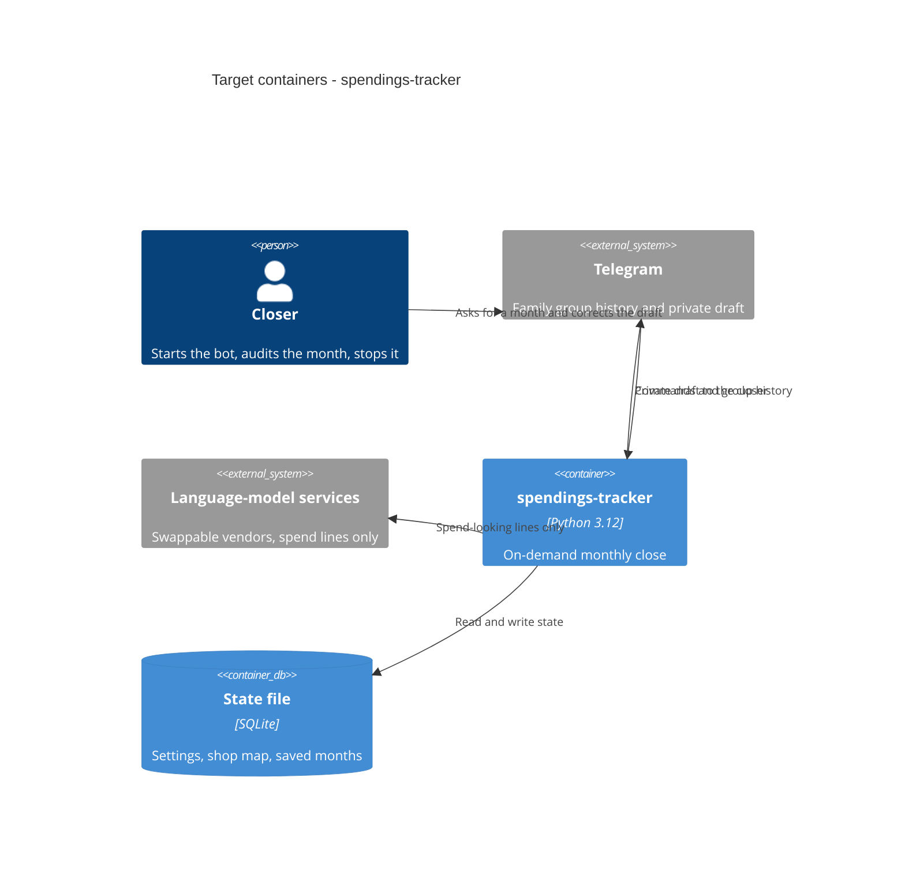

# Architecture map — spendings-tracker

> Target foundation for an empty repo (`mode: greenfield-bootstrap`). Produced by `survey` after
> a guided-default confirm. `scaffold` materializes this; refresh with `survey` when the tree
> drifts past `reflects_commit`. No hand-maintained `docs/architecture.md` exists.

## Stack

- Language / runtime: Python 3.12 (`docs/adr/0001-use-python-telegram-bot-and-compose.md:35`)
- Frameworks: one Telegram bot process (library chosen at scaffold / first feature); language-model vendors behind a port (`docs/adr/0001-use-python-telegram-bot-and-compose.md:29`)
- Build / test / lint: `uv sync` / `pytest` / `ruff check .` (`docs/adr/0001-use-python-telegram-bot-and-compose.md:35`)
- Run: Compose, app container + named volume; not always-on (`docs/adr/0001-use-python-telegram-bot-and-compose.md:29`)

## C4 — system as it is

Target baseline (nothing of this is in source yet).

## Module inventory

| Module | Path | Layers | Wired at | Responsibility |
|---|---|---|---|---|
| spendings_tracker | `src/spendings_tracker` | domain / app / ports / infra | `src/spendings_tracker/__main__.py` (target) | On-demand monthly close: harvest, filter, classify, audit, save |

No second module until a second bounded context appears (`docs/adr/0002-organize-code-as-hexagonal-layers.md:47`).

## Conventions (cited — the rules a new feature must match)

These are the agreed rules. Concrete source files appear when `scaffold` runs; until then the cite is the ADR that locked the rule.

- **Module wiring / registration:** one package; entry point constructs infra adapters and injects them at ports — `docs/adr/0002-organize-code-as-hexagonal-layers.md:28`
- **Error handling:** one application error type at the app layer; adapters translate vendor/Telegram failures into it — `docs/adr/0002-organize-code-as-hexagonal-layers.md:34`
- **IDs:** time-sortable ULID for persisted rows — `docs/adr/0003-persist-state-in-a-sqlite-file.md:47`
- **Persistence / DB access:** SQLite file via the persistence port; domain does not import the driver — `docs/adr/0003-persist-state-in-a-sqlite-file.md:34`
- **Migrations:** Alembic, apply + revert — `docs/adr/0003-persist-state-in-a-sqlite-file.md:34`
- **Tests:** `pytest` (unit at domain/app with fakes at ports; smoke that the app boots) — `docs/adr/0001-use-python-telegram-bot-and-compose.md:35`
- **Inter-module communication:** in-process calls only; no second service — `docs/adr/0002-organize-code-as-hexagonal-layers.md:34`
- **UI / styling (if a frontend exists):** no in-repo frontend; Telegram is the operator UI — `docs/idea-brief.md:51`

## Datastores

| Store | Engine | Accessed via | Notes |
|---|---|---|---|
| State file | SQLite | persistence port → infra | Named Compose volume; settings, shop→category map, saved months. ADR-0003. |

## Frontend / UI foundation

No frontend. Telegram is the closer’s UI. Skip in-repo component libraries until a later product decision.

## Where things live / closest precedents

Nothing has been scaffolded yet. After `_scaffold`:

- A new use-case (close a month, edit settings) → `src/spendings_tracker/app`, modelled on the first close-a-month use case.
- A new chat or model vendor → `src/spendings_tracker/ports` + `src/spendings_tracker/infra`, never `domain`.
- A new persisted concept → Alembic migration + persistence adapter; IDs are ULIDs.
- A new screen / UI component → not applicable (no frontend). Telegram messages are the surface; specify them as bot commands, not pages.

## Constraints & known tech-debt

- Local-only, on-demand: no always-on process, no hosting on someone else’s computers (idea brief §5).
- Only spend-looking lines may be sent to a language-model service (idea brief §5 / §6).
- One writer: two bot copies on the same SQLite file are unsafe (ADR-0003).
- Vendor must stay swappable; no SDK types in `domain` (ADR-0002).
- History-after-stop must work or the on-demand shape fails (idea brief §8) — first feature must prove Telegram history is readable on a cold start.
- `reflects_commit` is the empty-repo HEAD at foundation time; the map describes a target, not scanned code.

## Reconciliation with the authored architecture doc

No authored architecture doc (`docs/architecture.md`, `ARCHITECTURE.md`, or root `CLAUDE.md`). This map plus `docs/adr/0001`–`0003` is the current reference. Product intent lives in `docs/idea-brief.md` and was not re-litigated here.
