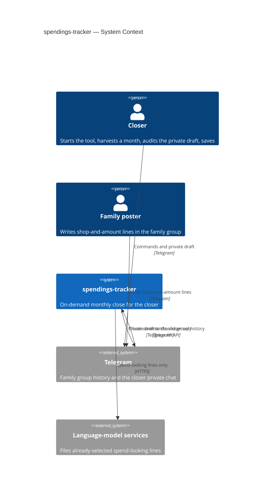
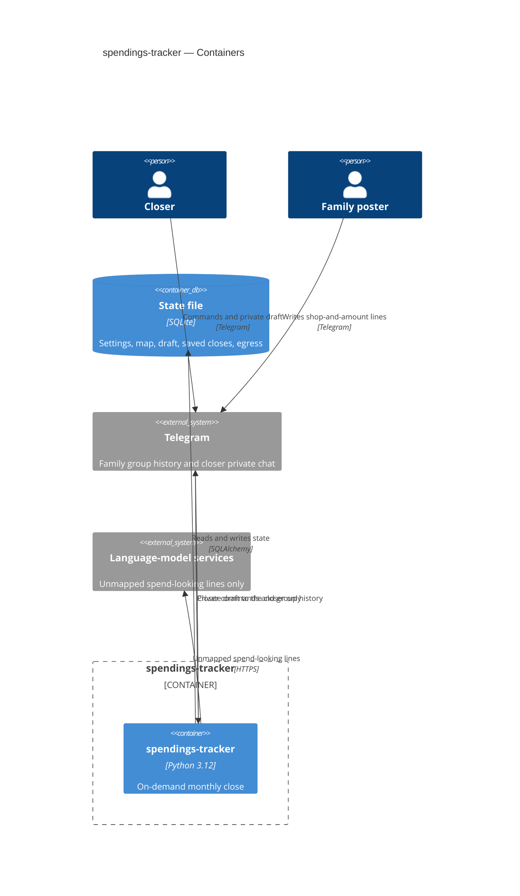
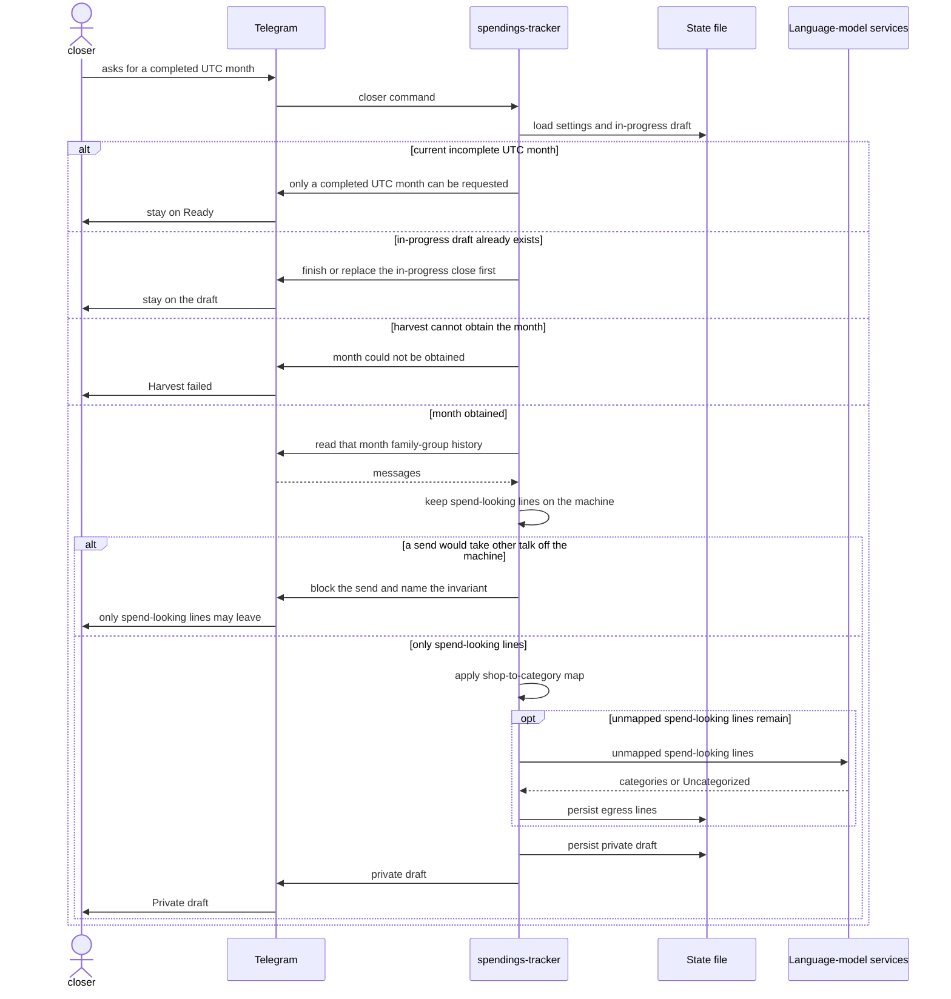
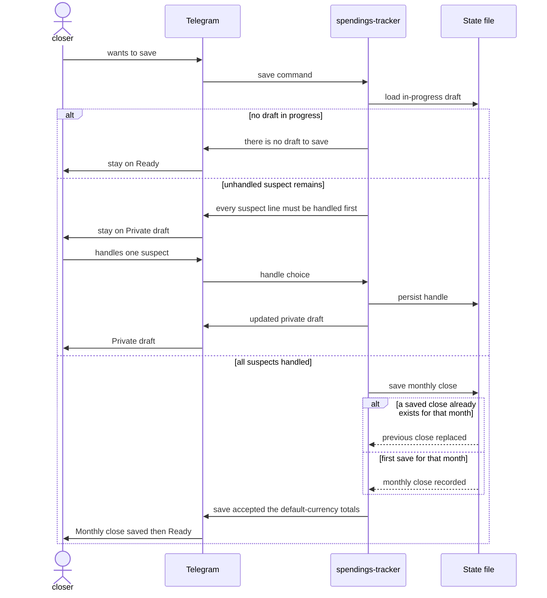

# Software Architecture Document — spendings-tracker

<!-- 12 Arc42 sections. Empty section → <!-- N/A: <one-line reason> -->. -->
<!-- C4 Context (L1) lives inline in §3. C4 Container (L2) lives inline in §5. -->
<!-- Numbers in §10 come VERBATIM from spec.md §6 NFR — no inventing, no rounding. -->

## 1. Introduction and goals

**Intent.** The closer — the only operator of a monthly close — starts this tool on demand, harvests a completed UTC month’s already-existing family-group messages without an export file, and turns spend-looking lines into a private draft they can audit and save. Family posters keep writing shop-and-amount mentions as usual and never become operators. Only spend-looking lines may leave the machine for a language-model service; settings, the shop-to-category map, saved monthly closes, and an in-progress draft survive a stop.

**Top-3 quality goals (1-liners; full scenarios in §10):**

1. Spend-looking-only egress — 100% of text sent off the machine for classification is spend-looking lines.
2. Time-to-draft — ≤ 180 seconds for a month with at most 500 family-group messages; months with more than 500 messages are still harvested in full with no 180-second promise.
3. Recoverability after an on-demand stop — settings and saved monthly closes survive; an in-progress draft survives; unplanned stop during a close fewer than 1 in 10 starts.

Time-to-ready (≤ 60 seconds after start) and overlapping monthly closes (0 in-progress drafts) remain spec §6 NFRs; they do not displace the top three.

**Stakeholders.**

| Role | Interest | Sign-off owner? |
|---|---|---|
| closer | Only operator: first-run, harvest, private draft, save | No |
| family poster | Source of shop-and-amount lines; never sees the draft | No |
| Tech Lead | SAD approval | Yes |
| Security Lead | Required security review (spec §6.1) | Yes |

The confirmed category list stays frozen after first-run (ADR-0001). The closer’s egress review for a close lists every spend-looking line that left the machine (ADR-0002).

## 2. Constraints

**Technical.**
- Python 3.12 (`requires-python >=3.12,<3.13`). One process. No second service. In-process calls only.
- Telegram is the closer’s UI; there is no in-repo frontend. The concrete Telegram library is not a §2 pin — it is a §4 choice (nothing in `pyproject.toml` yet).
- State is one SQLite file via SQLAlchemy ≥2.0 and Alembic ≥1.14. Path from `SPENDINGS_DB_PATH`; Compose mounts volume `spendings-state` at `/data` (`/data/spendings.sqlite`). One writer.
- Hexagonal layers in one package: `domain` / `app` / `ports` / `infra`. Domain and app do not import `infra`.
- Persisted row IDs are time-sortable ULIDs (repo ADR-0003). The helper is not in source yet; that is implementation work, not a different ID scheme.

**Organisational.**
- No external deadline (spec §1). Waiting costs another unsummarized month, not a missed contract.
- Size L: this feature fills the scaffolded skeleton (layers exist; use cases, ports, and schema do not).
- Owner: Dell. Reviewers: Tech Lead, Security Lead.

**Conventions.**
- Follow `CLAUDE.md`, `docs/architecture-map.md`, and repo ADRs 0001–0003. Do not re-litigate that stack here.
- One application error type: `AppError`. Adapters translate vendor and Telegram failures into it.
- New use case → `app`. New chat or model vendor → `ports` + `infra`. New persisted concept → Alembic + persistence adapter.
- Tests: `pytest` at domain/app with fakes at ports; one smoke test that the app boots. Toolchain: `uv sync` / `pytest` / `ruff check .`.

**Regulatory / external.**
- Data is confidential household data: amounts, shops, spend-looking line text, and the closer’s identity in the family group.
- Only the account pinned as closer at first-run may see the draft or save a monthly close. The family group is never answered with draft or close detail.
- Only spend-looking lines may leave the machine for a language-model service.
- Security review is required (spec §6.1).

## 3. Context and scope

The closer starts spendings-tracker when they want a monthly close. The system harvests that completed UTC month from the family group via Telegram, keeps non-spend talk on the machine, files spend-looking lines, and shows a private draft only to the closer. Family posters keep writing in the existing group and never become operators.

Two trust boundaries matter: (1) the machine vs language-model services — only spend-looking lines may cross; (2) the closer’s private chat vs the family group — the draft, a refusal about the draft, and other monthly-close detail never go to the group.

<!-- brownfield: hexagonal skeleton after scaffold (HEAD 4056f74); architecture-map.md stale at a8f7fcc; layers empty except AppError, boot-and-exit __main__, empty Alembic 0001 -->

**External systems (in / out):**

| Actor or system | Type | Interaction |
|---|---|---|
| closer | Person | Starts the tool, finishes first-run, asks for a month, audits the private draft, saves |
| family poster | Person | Writes shop-and-amount lines in the family group; does not talk to this system as an operator |
| Telegram | System (external) | Family-group history in; closer commands and private draft out; never draft or close detail into the group |
| Language-model services | System (external) | Receive already-selected spend-looking lines only; file them into the frozen category list or Uncategorized |

**C4 Context (L1):**



## 4. Solution strategy

**Top strategic choices (the seeds for ADRs):**

1. **Own a single `backend-service` surface.** One Python process owns the monthly close. Telegram is the operator channel (command-and-reply conversation; `ux-flows.md` SCR-01–07), not a web, mobile, or desktop app. Downstream stages read `target_surfaces: [backend-service]` and do not re-derive it. There is no UI-architecture follow-on.

2. **Use a Bot API adapter for the closer UI and a user-session (MTProto) adapter for harvest.** The closer’s private conversation (first-run, draft, suspects, save) is a bot chat. Harvest of a completed UTC month after the tool was off uses the closer’s group access via a user session, with no export file. The family group is never answered with draft or close detail. (ADR-0003)

3. **Run the close pipeline synchronously in-process.** Ask for a month → harvest → on-machine spend-looking gate → shop-to-category map → language-model port → persist draft and egress list → show the private draft. The closer waits until the draft is visible. No second process and no in-process background job. (ADR-0004)

4. **Apply the shop-to-category map before the model and skip the send on a hit.** A mapped shop (trim + case, exact remaining spelling) is filed from the map and does not leave the machine. Unmapped spend-looking lines may be sent. The closer can still override on the draft. (ADR-0005)

Inherited, not re-opened: all durable state in one SQLite file (repo ADR-0003); closer pin is the Telegram account that finishes first-run (AC-01); language-model vendors stay behind a port (repo ADR-0002).

Each tactical decision in later sections should trace to one of these seeds. Tactical decisions that *contradict* a strategic choice are red flags — surface them in §11.

## 5. Building block view

This feature extends the existing `spendings_tracker` package. Hexagonal layers (`domain` / `app` / `ports` / `infra`) are already the repo convention; domain and app stay free of Telegram, vendor SDKs, and the database driver. There is no second bounded context.

**Internal decomposition:**

```
src/spendings_tracker/
├── domain/          spend-looking rule, completed UTC month, frozen categories,
│                    shop match, draft / suspect / clean line
├── app/             first-run, harvest-month, handle-suspect, save-close, resume
├── ports/           CloserUiPort, HarvestPort, ModelPort, PersistencePort
│                    (ADR-0006)
├── infra/           telegram bot adapter, telegram user-session adapter,
│                    language-model adapter, sqlite adapter
└── __main__.py      construct adapters, inject at ports, run until the closer stops
```

**C4 Container (L2):**



## 6. Runtime view

Participants are the §5 containers and actors. Messages are semantic. `sequences` later covers every spec §5 acceptance criterion (first-run and stop/resume are not seeded here).

**Critical flow 1: harvest a completed month to a private draft**



**Critical flow 2: handle suspects and save**



## 7. Deployment view

<!-- 🎯 Why: the TOPOLOGY DevOps must know without reading the deploy charts — how many replicas,
     where the background worker lives, AT WHAT NUMBERS we scale.
     📋 Write: 2–3 sentences on topology + monitoring + concrete threshold numbers.
     📌 e.g. «500 authors → partition by quarter» (not «we'll think about scale later»).
     🎯 N/A allowed for XS/S that reuses an existing deployment unit with no change.
     Deployment-diagram scaffold → templates/deployment.md. -->

<Topology in 2–3 sentences. Where it runs, replicas, scaling thresholds.>

**Monitoring:**
- <Metrics — e.g. `<metric_name>`>
- <Alerts — e.g. «worker lag > 10 min → page on-call»>
- <Tracing — e.g. spans on the request boundary>

**Scaling thresholds:**
- <e.g. comfortable in one table up to N rows/year>
- <e.g. partition by quarter above N rows/year>

## 8. Crosscutting concepts

<!-- 🎯 Why: CROSS-CUTTING PATTERNS spanning several modules: logging, errors, authorization, ID
     strategy, events, caching. ⭐ The second-densest section. A pattern inside one module is NOT
     here; a project-wide convention belongs in the convention file.
     📋 Write: a table — concept / convention / where defined. One row per concept.
     📌 e.g. «sortable time-based IDs generated in the app layer» as a default from the convention file. -->

| Concept | Convention | Where defined |
|---|---|---|
| Logging | <e.g. structured, fields `module=<name>`> | <convention file §X or here> |
| Authentication | <e.g. token-based via middleware> | <convention file §X> |
| Error handling | <e.g. domain sentinel → ports error mapping → JSON> | <convention file §X> |
| ID strategy | <e.g. sortable time-based ID in the app layer> | <convention file §X> |
| Internationalisation | <e.g. N/A, single language> | — |
| Observability | <e.g. tracing on the request boundary> | — |
| Events | <module-specific patterns, if any> | <here> |

## 9. Architecture decisions

<!-- 🎯 Why: the REVERSE INDEX onto the adr/ folder. `ls adr/` gives the files; §9 gives the
     semantics — why they exist, which SAD section they attach to, what status.
     📋 Write: a 4-column table, one row per ADR. Mixed status is fine.
     📌 e.g. «0001 | Store content as a table of typed blocks | Accepted | §4». -->

| # | Title | Status | Section |
|---|---|---|---|
| <NNNN> | <imperative — e.g. "Use a sliding-window counter for rate limiting"> | Accepted | §<N> |
| <NNNN> | <imperative — e.g. "Co-locate the worker in the API process"> | Accepted | §<N> |

ADR files live under `docs/features/<slug>/adr/NNNN-<title>.md`.

## 10. Quality requirements

<!-- 🎯 Why: the QUALITY TREE — take a goal from §1 and break it into concrete leaves: tests,
     metrics, configs, drills. ⭐ Without §10, §1 is a manifesto. With §10 each declaration maps
     to something PROVABLE.
     📋 Write: per §1 goal — When / Then / How-verify. Numbers from spec §6 NFR VERBATIM (don't
     round ≤250ms to ≤300ms — that's a critic F6 hit).
     📌 e.g. «p95 ≤ 500 ms on a block update, verified by a 100 req/s load test». -->

Each top-3 goal from §1 expanded into a full scenario:

**QG-1. <quality attribute>**
- **When:** <trigger condition>
- **Then:** <expected behaviour with numbers from spec §6 NFR>
- **How verify:** <test / chaos drill / load test / metric>

**QG-2. <quality attribute>**
- **When:** <trigger>
- **Then:** <expected>
- **How verify:** <how>

**QG-3. <quality attribute>**
- **When:** <trigger>
- **Then:** <expected>
- **How verify:** <how>

## 11. Risks and technical debt

<!-- 🎯 Why: ⭐ collects EVERYTHING that can break — not only the technical. Without §11 risks get
     discussed at standups and lost; debt lives only in the head of whoever accepted it.
     📋 Write: a risk/debt table — severity — mitigation — owner. Accepted debt in its own block.
     📌 The first risk is often a product risk, not a technical one. That's normal. -->

<!-- Severity literals: Low / Medium / High for regular risks; "Open question" for rows created by
     a Save-as-OQ resolution during the Socratic walk (see references/socratic.md). -->

| Risk / debt | Severity | Mitigation | Owner |
|---|---|---|---|
| <e.g. Worker lag may reach hours during a downstream outage> | Medium | <alert >10 min, on-call playbook, retry backoff> | <DevOps> |
| <e.g. No event-schema versioning in v1> | Medium | <ADR-NNNN planned for v2, tolerate unknown fields> | <Backend> |
| Open architectural decision: <decision-headline> | Open question | Resolve before <stage trigger or YYYY-MM-DD>; <inline rationale from the Save-as-OQ> | <owner> |

**Accepted debt (acceptable in v1, plan to fix later):**
- <e.g. the entity is immutable / unversioned — OK for v1, may need audit versioning in v2>

## 12. Glossary

<!-- 🎯 Why: ⭐ the DOMAIN GLOSSARY that ends arguments a year later («checkpoint — weekly or
     biweekly? quarter — calendar or fiscal?»).
     📋 Write: a term / meaning table. Business + technical terms mixed.
     📌 e.g. «Lesson | a unit inside a course made of blocks (text, video)». -->

| Term | Meaning |
|---|---|
| <e.g. domain object A> | <its meaning in this domain> |
| <e.g. domain object B> | <its meaning> |
| <e.g. domain invariant name> | <the rule, in plain language> |
