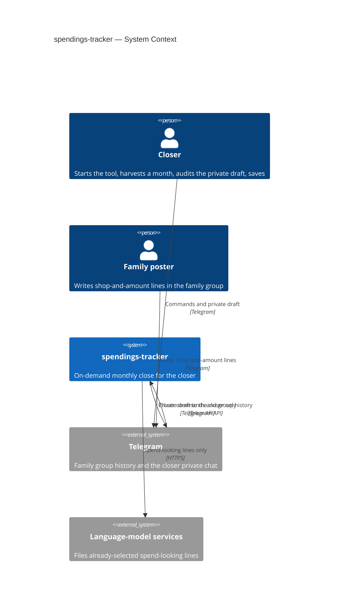
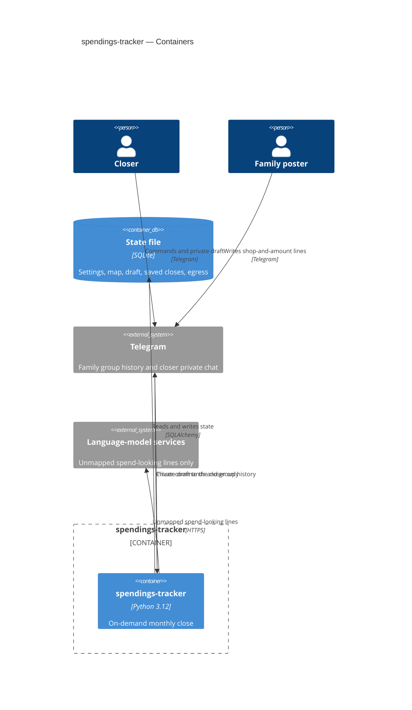
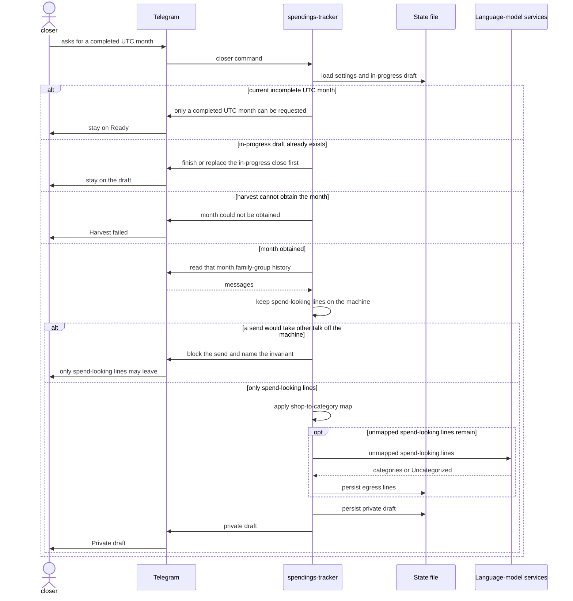
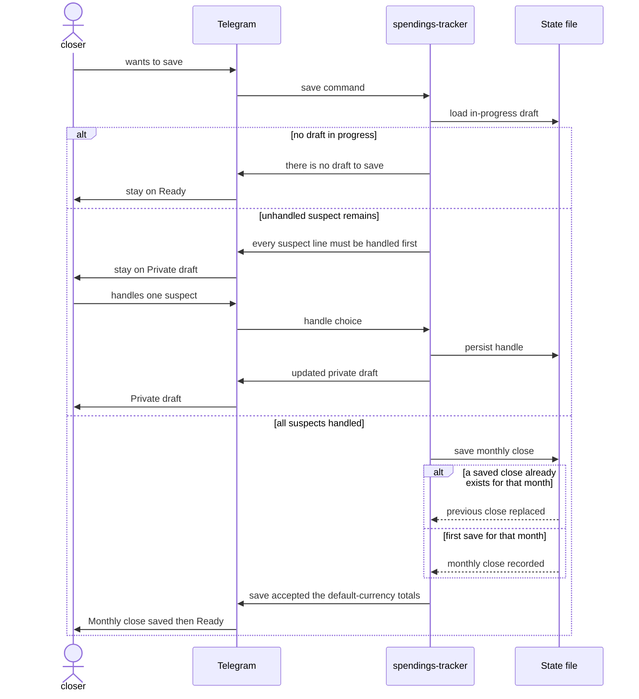

# Software Architecture Document — spendings-tracker

## 1. Introduction and goals

**Intent.** The closer — the only operator of a monthly close — starts this tool on demand, harvests a completed UTC month’s already-existing family-group messages without an export file, and turns spend-looking lines into a private draft they can audit and save. Family posters keep writing shop-and-amount mentions as usual and never become operators. Only spend-looking lines may leave the machine for a language-model service; settings, the shop-to-category map, saved monthly closes, and an in-progress draft survive a stop.

**Top-3 quality goals (1-liners; full scenarios in §10):**

1. Spend-looking-only egress — 100% of text sent off the machine for classification is spend-looking lines.
2. Time-to-draft — ≤ 180 seconds for a month with at most 500 family-group messages; months with more than 500 messages are still harvested in full with no 180-second promise.
3. Recoverability after an on-demand stop — settings and saved monthly closes survive; an in-progress draft survives; unplanned stop during a close fewer than 1 in 10 starts.

Time-to-ready (≤ 60 seconds after start) and overlapping monthly closes (0 in-progress drafts) remain spec §6 NFRs; they do not displace the top three.

**Stakeholders.**

| Role | Interest | Sign-off owner? |
|---|---|---|
| closer | Only operator: first-run, harvest, private draft, save | No |
| family poster | Source of shop-and-amount lines; never sees the draft | No |
| Tech Lead | SAD approval | Yes |
| Security Lead | Required security review (spec §6.1) | Yes |

The confirmed category list stays frozen after first-run (ADR-0001). The closer’s egress review for a close lists every spend-looking line that left the machine (ADR-0002).

## 2. Constraints

**Technical.**
- Python 3.12 (`requires-python >=3.12,<3.13`). One process. No second service. In-process calls only.
- Telegram is the closer’s UI; there is no in-repo frontend. The concrete Telegram library is not a §2 pin — it is a §4 choice (nothing in `pyproject.toml` yet).
- State is one SQLite file via SQLAlchemy ≥2.0 and Alembic ≥1.14. Path from `SPENDINGS_DB_PATH`; Compose mounts volume `spendings-state` at `/data` (`/data/spendings.sqlite`). One writer.
- Hexagonal layers in one package: `domain` / `app` / `ports` / `infra`. Domain and app do not import `infra`.
- Persisted row IDs are time-sortable ULIDs (repo ADR-0003). The helper is not in source yet; that is implementation work, not a different ID scheme.

**Organisational.**
- No external deadline (spec §1). Waiting costs another unsummarized month, not a missed contract.
- Size L: this feature fills the scaffolded skeleton (layers exist; use cases, ports, and schema do not).
- Owner: Dell. Reviewers: Tech Lead, Security Lead.

**Conventions.**
- Follow `CLAUDE.md`, `docs/architecture-map.md`, and repo ADRs 0001–0003. Do not re-litigate that stack here.
- One application error type: `AppError`. Adapters translate vendor and Telegram failures into it.
- New use case → `app`. New chat or model vendor → `ports` + `infra`. New persisted concept → Alembic + persistence adapter.
- Tests: `pytest` at domain/app with fakes at ports; one smoke test that the app boots. Toolchain: `uv sync` / `pytest` / `ruff check .`.

**Regulatory / external.**
- Data is confidential household data: amounts, shops, spend-looking line text, and the closer’s identity in the family group.
- Only the account pinned as closer at first-run may see the draft or save a monthly close. The family group is never answered with draft or close detail.
- Only spend-looking lines may leave the machine for a language-model service.
- Security review is required (spec §6.1).

## 3. Context and scope

The closer starts spendings-tracker when they want a monthly close. The system harvests that completed UTC month from the family group via Telegram, keeps non-spend talk on the machine, files spend-looking lines, and shows a private draft only to the closer. Family posters keep writing in the existing group and never become operators.

Two trust boundaries matter: (1) the machine vs language-model services — only spend-looking lines may cross; (2) the closer’s private chat vs the family group — the draft, a refusal about the draft, and other monthly-close detail never go to the group.

<!-- brownfield: hexagonal skeleton after scaffold (HEAD 4056f74); architecture-map.md stale at a8f7fcc; layers empty except AppError, boot-and-exit __main__, empty Alembic 0001 -->

**External systems (in / out):**

| Actor or system | Type | Interaction |
|---|---|---|
| closer | Person | Starts the tool, finishes first-run, asks for a month, audits the private draft, saves |
| family poster | Person | Writes shop-and-amount lines in the family group; does not talk to this system as an operator |
| Telegram | System (external) | Family-group history in; closer commands and private draft out; never draft or close detail into the group |
| Language-model services | System (external) | Receive already-selected spend-looking lines only; file them into the frozen category list or Uncategorized |

**C4 Context (L1):**



## 4. Solution strategy

**Top strategic choices (the seeds for ADRs):**

1. **Own a single `backend-service` surface.** One Python process owns the monthly close. Telegram is the operator channel (command-and-reply conversation; `ux-flows.md` SCR-01–07), not a web, mobile, or desktop app. Downstream stages read `target_surfaces: [backend-service]` and do not re-derive it. There is no UI-architecture follow-on.

2. **Use a Bot API adapter for the closer UI and a user-session (MTProto) adapter for harvest.** The closer’s private conversation (first-run, draft, suspects, save) is a bot chat. Harvest of a completed UTC month after the tool was off uses the closer’s group access via a user session, with no export file. The family group is never answered with draft or close detail. (ADR-0003)

3. **Run the close pipeline synchronously in-process.** Ask for a month → harvest → on-machine spend-looking gate → shop-to-category map → language-model port → persist draft and egress list → show the private draft. The closer waits until the draft is visible. No second process and no in-process background job. (ADR-0004)

4. **Apply the shop-to-category map before the model and skip the send on a hit.** A mapped shop (trim + case, exact remaining spelling) is filed from the map and does not leave the machine. Unmapped spend-looking lines may be sent. The closer can still override on the draft. (ADR-0005)

Inherited, not re-opened: all durable state in one SQLite file (repo ADR-0003); closer pin is the Telegram account that finishes first-run (AC-01); language-model vendors stay behind a port (repo ADR-0002).

Each tactical decision in later sections should trace to one of these seeds. Tactical decisions that *contradict* a strategic choice are red flags — surface them in §11.

## 5. Building block view

This feature extends the existing `spendings_tracker` package. Hexagonal layers (`domain` / `app` / `ports` / `infra`) are already the repo convention; domain and app stay free of Telegram, vendor SDKs, and the database driver. There is no second bounded context.

**Internal decomposition:**

```
src/spendings_tracker/
├── domain/          spend-looking rule, completed UTC month, frozen categories,
│                    shop match, draft / suspect / clean line
├── app/             first-run, harvest-month, handle-suspect, save-close, resume
├── ports/           CloserUiPort, HarvestPort, ModelPort, PersistencePort
│                    (ADR-0006)
├── infra/           telegram bot adapter, telegram user-session adapter,
│                    language-model adapter, sqlite adapter
└── __main__.py      construct adapters, inject at ports, run until the closer stops
```

**C4 Container (L2):**



## 6. Runtime view

Participants are the §5 containers and actors. Messages are semantic. `sequences` later covers every spec §5 acceptance criterion (first-run and stop/resume are not seeded here).

**Critical flow 1: harvest a completed month to a private draft**



**Critical flow 2: handle suspects and save**



## 7. Deployment view

One Compose service `app` and one named volume `spendings-state` mounted at `/data`. The closer starts the stack for a close and stops it afterwards. There are no replicas, no load balancer, and no always-on host. While the process is up it long-polls Telegram; a public webhook URL would require hosting the spec forbids.

**Monitoring:**
- Time-to-ready — closer wall-clock from start until they can ask for a month or finish first-run (spec §6: ≤ 60 seconds)
- Time-to-draft — closer wall-clock from ask until the draft is visible (spec §6: ≤ 180 seconds for a month with at most 500 family-group messages)
- Egress review — persisted list of every spend-looking line that left (ADR-0002)
- Unplanned stop — closer’s own count (spec §6: fewer than 1 in 10 starts)
- Tracing — none in v1 (no hosted operator, no on-call)

**Scaling thresholds:**
- One household, one writer, one in-progress draft
- One SQLite file stays the store for a family-group month, including months with more than 500 messages (harvested in full, no 180-second promise)
- Do not run a second copy against the same file (repo ADR-0003)

## 8. Crosscutting concepts

| Concept | Convention | Where defined |
|---|---|---|
| Logging | Stdlib logging in adapters; no hosted log drain | here |
| Authentication / AuthZ | The Telegram account that finishes first-run is the only closer; any other account hits Unauthorized with no draft or close detail | spec AC-01, AC-06 |
| Error handling | `AppError` at app; adapters translate Telegram and vendor failures into it | repo ADR-0002 |
| ID strategy | Time-sortable ULID for persisted rows | repo ADR-0003 |
| Internationalisation | N/A — one operator, one language the closer already uses in the group | — |
| Observability | Closer wall-clock + full egress list; no tracing SaaS | §7, ADR-0002 |
| Events | None — in-process synchronous calls | §4, ADR-0004 |
| Secrets | Bot token from the environment; Telegram user session on the data volume next to the SQLite file | ADR-0007 |
| Rate limiting | No product limiter; adapters respect Telegram flood limits | infra |

## 9. Architecture decisions

| # | Title | Status | Section |
|---|---|---|---|
| 0001 | Freeze the category list after first-run | Accepted | §1 |
| 0002 | Persist every egress line for closer review | Accepted | §1 |
| 0003 | Use Bot UI and user-session harvest | Accepted | §4 |
| 0004 | Run the close pipeline synchronously | Accepted | §4 |
| 0005 | Apply the shop map before the model | Accepted | §4 |
| 0006 | Split closer-UI and harvest ports | Accepted | §5 |
| 0007 | Store the user session on the data volume | Accepted | §8 |

ADR files live under `docs/features/spendings-tracker/adr/NNNN-<title>.md`. Repo-level ADRs 0001–0003 (Python + Compose, hexagonal layers, SQLite) stay in `docs/adr/` and are constraints, not rows here.

## 10. Quality requirements

Each top-3 goal from §1 expanded into a full scenario. Numbers from spec §6 NFR verbatim.

**QG-1. Spend-looking-only egress**
- **When:** lines are sent off the machine for classification
- **Then:** 100% of text sent off the machine for classification is spend-looking lines
- **How verify:** a harvest fixture with mixed family-group talk; the persisted egress list equals the lines passed to `ModelPort` and contains no other talk; the closer can open that full list for the close

**QG-2. Time-to-draft**
- **When:** the closer asks for a completed UTC month that has at most 500 family-group messages
- **Then:** the draft is visible in ≤ 180 seconds (closer wall-clock from asking until the draft is visible). Months with more than 500 messages are still harvested in full with no 180-second promise
- **How verify:** a timed app-layer test with a fake `HarvestPort` of 500 messages and a fake `ModelPort`; assert wall-clock. A separate case with more than 500 messages asserts completeness, not the 180-second bound

**QG-3. Recoverability after an on-demand stop**
- **When:** the closer stops after saving settings and a monthly close, or with a draft in progress (including handles already made)
- **Then:** a later start still has the default currency, frozen category list, shop-to-category map, saved monthly close, and any in-progress draft. Unplanned stop during a close: fewer than 1 in 10 starts
- **How verify:** stop/start against the real SQLite file in a test. The unplanned-stop rate is the closer’s own count (spec measurement), not an automated flake quota

## 11. Risks and technical debt

| Risk / debt | Severity | Mitigation | Owner |
|---|---|---|---|
| Cold-start harvest fails (user session missing, Telegram blocks the client, or group history unreadable) | High | Prove harvest on a real completed month before other use cases; treat session login as first-run work | Dell |
| User session on the data volume can impersonate the closer | High | Volume permissions + disk encryption; required security review (spec §6.1, ADR-0007) | Security Lead |
| A clean line is still wrong because the closer does not inspect every clean line | Medium | Accepted residual (spec §6.1); do not claim bank-grade completeness; save is acceptance | closer |
| Stop during the synchronous harvest wait loses unfinished work | Medium | Closer asks again; no mid-harvest draft until persist (ADR-0004) | closer |
| Stale shop map keeps filing a shop until the closer overrides | Medium | Override updates the map (ADR-0005) | closer |
| Language-model service down or slow blows the 180-second budget | Medium | Translate to `AppError`; closer retries; tests use a fake `ModelPort` | Dell |
| Two writers on the same SQLite file | Low | One Compose service; do not scale out (repo ADR-0003) | Dell |
| Scaffold is empty (no Telegram library, no ULID helper, `__main__` boots and exits, schema is empty `0001`) | Medium | First feature fills ports, wiring, and the next Alembic revision | Dell |
| `docs/architecture-map.md` is stale (`reflects_commit` a8f7fcc vs HEAD after scaffold) | Low | Re-run `/sdd:survey` | Dell |

**Accepted debt (acceptable in v1, plan to fix later):**
- Silent wrong totals from unaudited clean lines (spec §6.1)
- First language-model vendor is unnamed; only the port is locked
- Feature ADR count is 7 (size L typical band is 10–15); further ADRs only if implement hits a new blast-radius choice

## 12. Glossary

Roles and domain terms match `docs/features/spendings-tracker/CONTEXT.md`. Terms marked *surfaced here* are not in that glossary yet — consider `/sdd:glossary spendings-tracker` if they should be canonical.

| Term | Meaning |
|---|---|
| closer | The only operator of a monthly close: starts the tool, asks for a month, reviews the private draft, and saves |
| family poster | Any member of the family group who writes messages there, including the closer when they post |
| monthly close | A saved month the closer trusts after reviewing suspect lines and accepting the category totals |
| spend-looking line | A shop-and-amount mention taken from a family-group message that looks like a spend; one message may yield several lines; the only text that may leave the machine for a language-model service |
| draft | The private list of a month’s spend-looking lines that only the closer sees; never posted to the family group |
| suspect line | A draft line that is missing an amount, uses a currency other than the default currency, or is Uncategorized; the closer must handle it before saving |
| clean line | A spend-looking line that is not a suspect line; not a promise the line is factually correct |
| default currency | The currency the closer chooses on first run (preset EUR) |
| shop-to-category map | Optional memory of shop → category; starts empty and grows from the closer’s corrections |
| category | A name on the short list the closer confirmed on first run; later monthly closes must not invent new names |
| Uncategorized | The bucket for a spend-looking line that does not fit any confirmed category; always a suspect line; not a member of the confirmed list |
| harvest | The on-demand read of a completed UTC month’s already-existing family-group history, using the closer’s access, without an export file |
| egress *surfaced here* | A send of spend-looking line text off the machine to a language-model service; every such line is persisted for closer review |
| user session *surfaced here* | The closer’s Telegram login (MTProto) used to harvest group history; stored on the data volume |
| AppError | The one application error type; adapters translate vendor and Telegram failures into it |
