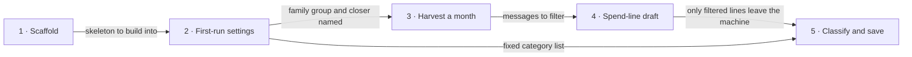

# Roadmap — spendings-tracker

> **A decomposition, not a promise.** The overall idea broken into incremental steps: what each
> step is, where it comes from, how big it is — or that nobody has looked at it yet — and in which
> order, and parallel lanes, we walk them. **No dates** (except shipped history), **no scores** —
> order is the prioritization. The *solution* for any step lives in its `docs/features/<slug>/`
> spec, not here.

## Destination

The closer can start the bot on this computer, take a month of family-group spend lines, audit a private categorized draft, save the trusted month and settings, and stop the bot — with only spend-looking lines ever leaving the machine.

## Steps

| # | Step | Source | Size | Status |
|---|---|---|:---:|---|
| 1 | Scaffold the greenfield skeleton | architecture-map.md Target foundation | S | idea |
| 2 | First-run settings that survive stop | idea-brief.md §7 Recommendation | S | idea |
| 3 | Harvest a month after the bot was off → see [Not yet specified](#not-yet-specified) | idea-brief.md §8 Open questions | fog | idea |
| 4 | Private spend-line draft | idea-brief.md §7 Recommendation | M | idea |
| 5 | Classify, audit, and save the month | idea-brief.md §7 Recommendation | M | idea |
| 6 | On-demand monthly close (first product) | [docs/features/spendings-tracker/](features/spendings-tracker/spec.md) | L | shipped |

## Not yet specified

| Area | What we'd have to learn | Blocks | How it gets sharpened |
|---|---|:---:|---|
| History after stop | Official Bot API `getUpdates` keeps missed updates at most 24 hours and has no `getChatHistory`, so a cold start cannot re-read last month's family group. The replacement harvest (user-account client, chat export, a collector that must stay up, or something else) is not formulated. | 3 | Recon pass on a readable-history client, then a conversation with the owner on which harvest shape still matches the on-demand close |

## Out of scope

- Treating the family as product users, or charging other families — the closer is the only operator.
- Changing family habit, “only the closer logs,” or “forward spends to the bot” — the source is harvest of what the group already writes.
- Totals-only reports with no line list — a close is believed only after audit.
- Sending a whole month of group chat to an outside language-model service — only spend-looking lines may leave the machine.
- Converting amounts into one output money, or multi-currency grand totals — one default currency; other currencies stay as-is and are flagged in the audit.
- Letting the model invent category names each run — the closer owns a short fixed list.
- A file-only close with no bot conversation — Telegram is both archive and how the closer asks for the month.
- Receipt photos, voice messages, reports as pictures, hosting on someone else’s computers.
- Comparing saved months, yearly reports, scheduled recurring spends, and a spending advisor.

## Open decisions

| # | Question | Type | Owner | Blocks |
|---|---|:---:|:---:|:---:|
| D1 | What is the default currency, and what are the first category names on the fixed list? | grilling | human | 2 |
| D2 | Given Bot API missed-update retention of 24 hours and no chat history method, which harvest shape still delivers a month the closer can close? | grilling | human | 3 |
| D3 | Start the shop→category map empty, or seed a few known shops at first setup? | grilling | human | 5 |
| D4 | How incomplete can a harvested month be and still count as a trusted close (missing cash vs. wrong lines)? | grilling | human | 5 |
| D5 | Can a user-account / MTProto client read a month of group history that a bot member can see? | research | agent | 3 |

## Decisions so far

- Use Python 3.12, one Telegram bot process, and Compose → [`docs/adr/0001-use-python-telegram-bot-and-compose.md`](adr/0001-use-python-telegram-bot-and-compose.md)
- Organize code as hexagonal layers in one package → [`docs/adr/0002-organize-code-as-hexagonal-layers.md`](adr/0002-organize-code-as-hexagonal-layers.md)
- Persist settings, shop map, and saved months in a SQLite file on a named volume → [`docs/adr/0003-persist-state-in-a-sqlite-file.md`](adr/0003-persist-state-in-a-sqlite-file.md)
- Closer-only on-demand monthly close; fixed category list; no conversion; only spend-looking lines leave the machine → [`docs/idea-brief.md`](idea-brief.md) §7 Recommendation

## Dependency graph

## Execution path

| Wave | Steps | Zone per step (why parallel-safe) | Unlocks |
|:---:|---|---|---|
| 1 | 1 | 1: `src/spendings_tracker` (new) | 2 |
| 2 | 2 | 2: `src/spendings_tracker` (new) — sequential; same package, no parallel lane | harvest recon (step 3) |

## Shipped

| Step | Shipped | Link |
|---|---|---|
| On-demand monthly close (first product) | 2026-09-05 | [changelog](features/spendings-tracker/changelog.md) |
